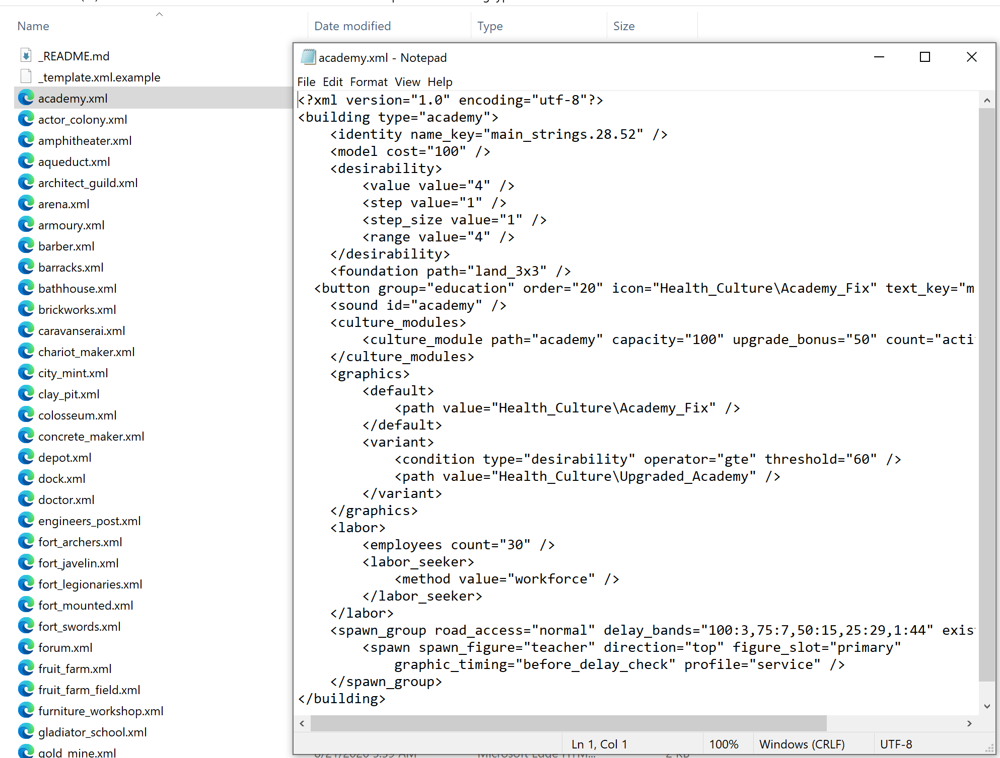
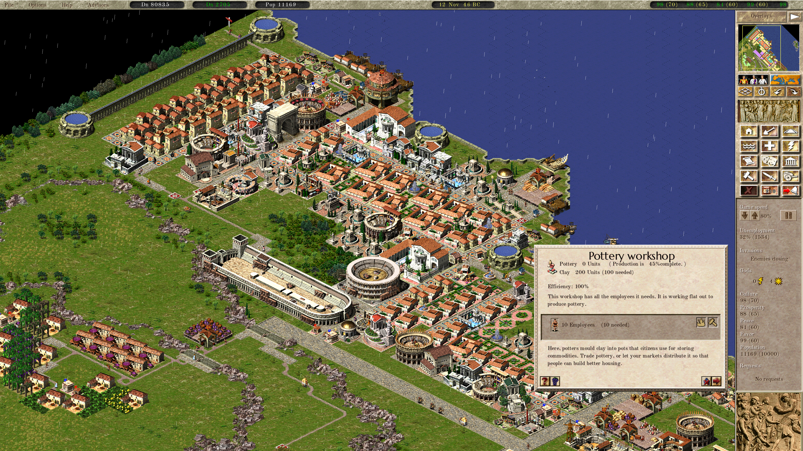
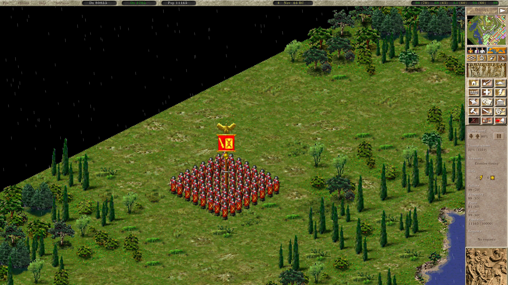

# Augustus 

 **💬 Join the Augustus Community - players, mapmakers, and developers**  
  
kindly hosted by GamerZakh.

 **📜 Share Maps, Campaigns and Scenarios**  
  
Download Julius and Augustus scenarios, create your own and share with others! 

| Platform | Latest release | Unstable build |
|----------|----------------|----------------|
| Windows - 64 bit| Next release! |   [(Download development assets)](https://augustus.josecadete.net/download/latest/development/assets)
| Windows - 32 bit  | |
| Linux AppImage |  | 
| Linux Flatpak | Next release! | 
| Mac |  |  |
| PS Vita | |  |
| Switch |   |  |
| Android APK |   |  |

Alternatively, you can [**try Augustus in your browser**](https://augustus.josecadete.net/play/). Note that you'll still need to provide a valid Caesar 3 installation folder.

Augustus is a fork of the Julius project that intends to incorporate gameplay changes.
=======
The aim of this project is to provide enhanced, customizable gameplay to Caesar 3 using project Julius UI enhancements.

Augustus is able to load Caesar 3 and Julius saves, however saves made with Augustus **will not work** outside Augustus.

Gameplay enhancements include:
- Roadblocks
- Market special orders
- Global labour pool
- Partial warehouse storage
- Increased game limits
- Zoom controls
- And more!

Because of gameplay changes and additions, save files from Augustus are NOT compatible with Caesar 3 or Julius. Augustus is able to load Caesar 3 save files, but not the other way around. If you want vanilla experience with visual and UI improvements, or want to use save files in base Caesar 3, check [Julius](https://github.com/bvschaik/julius).

Augustus, like Julius, requires the original assets (graphics, sounds, etc) from Caesar 3 to run. Augustus optionally [supports the high-quality MP3 files](https://github.com/bvschaik/julius/wiki/MP3-Support) once provided on the Sierra website.

## Running the game

Currently, you have to build it yourself. I'm mantaining a Visual Studio 2022 project for it for now. But Linux support will be added back eventually. Once it is stable enough, I'll distribute the executable on this repo, right now expect crashes.

Then you can either copy the game to the Caesar 3 folder, or run the game from an independent
folder, in which case the game will ask you to point to the Caesar 3 folder.

Note that you must have permission to write in the game data directory as the saves will be
stored there.

See [Running Julius](https://github.com/bvschaik/julius/wiki/Running-Julius) for further instructions and startup options.

## Mod Support

This fork aims to add full mod support to the Caesar 3 engine, with the goal of eventually having compatibility with Pharaoh as well. Many hardcoded values were exported to xml, and the full gameplay from Julius and Augustus are being slowly reproduced inside the improved engine made for Vespasian.

## Vespasian gameplay

This fork builds on Augustus with a slower simulation rhythm, busier cities, and XML-defined gameplay and graphics. Days are twice as long, the number of days on a month are calendar accurate. Workers actually commute to their jobs, to compensate walkers have longer ranges.

Services are smart, with walkers prioritizing walking over places that haven't been visited recently. Pathfinding was added to job seekers.

The road tool now places highways with shift and blockers with ctrl. Likewise, the clear tool is now smart and comes with a repair on ctrl and tree removal mode on shift.

When placing a building, holding shift will force place it over trees and roads. Holding a road tool over water places bridges, shift for high bridges.

### Building UI and production

Vectorized fonts are now supported and rendered in full resolution. Some UIs have already been reworked, production buildings now display their storage, efficiency, and staffing from the building information panel in a standard way.

### Military formations

Formations were made larger, unit ordering more natural with soldiers arranged around their legion standard. Attacking an enemy formation now causes units to chase them.

## Vespasian developer notes

This fork is migrating legacy C/static-table runtime behavior toward XML-defined objects and object-owned C++ runtime relationships. Before refactoring hot paths, read:

- [Object-owned runtime refactor doctrine](docs/object_owned_runtime_refactor.md)
- [Building reference runtime architecture](docs/building_reference_runtime_architecture.md)
- [Save/load runtime bridges](docs/save_load_runtime_bridges.md)

The intended direction is to replace repeated scans, string/id lookups, static cleanup helpers, and defensive fallback layers with object-owned registration, deregistration, and lifecycle cleanup.

## Manual

Augustus changes are explained in detail in the comprehensive manual. Below you can find the links to the manual in a few language versions.

| Language | Manual |
|----------|--------|
|English   |[Download](https://github.com/Keriew/augustus/raw/master/res/manual/augustus_manual_en_4_0.pdf)|
|Chinese   |[Download](https://github.com/Keriew/augustus/raw/master/res/translated_manuals/augustus_manual_chinese_3.0.pdf)|
|French   |[Download](https://github.com/Keriew/augustus/raw/master/res/translated_manuals/augustus_manual_fr_4_0.pdf)|
|Polish   |[Download](https://github.com/Keriew/augustus/raw/master/res/translated_manuals/augustus_manual_polish_3.0.pdf)|
|Russian   |[Download](https://github.com/Keriew/augustus/raw/master/res/translated_manuals/augustus_manual_russian_3.0.pdf)|

## Bugs

See the list of [Bugs & idiosyncrasies](https://github.com/bvschaik/julius/wiki/Caesar-3-bugs) to find out more about some known bugs.
