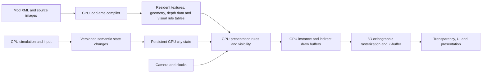

# GPU-driven orthographic renderer: gap analysis and migration plan

Exploration of the working tree, 2026-09-07. Includes the requested 3D orthographic camera and real Z-buffer. This is a proposal, not an implementation or a measured performance result. Existing unrelated working-tree changes were left alone; no build, deployment, asset extraction, or benchmark was performed.

## Intended outcome

The target is feasible: keep graphics resources and a compact representation of the city in GPU-accessible device-local memory; publish changes from simulation; let GPU programs select visual variants, animate, generate visible instances, project world positions, and rasterize with depth testing.

The user's implementation priority is **replace SDL2 rendering with Vulkan first, then recover CPU time for higher sustained TPS while FPS remains capped to VSync**. The order below reflects that priority. The 3D/depth endpoint remains, but a full art-depth conversion must not postpone the first usable Vulkan executable or the early CPU-throughput improvements.

Vulkan replaces `SDL_Renderer`/`SDL_Texture` and their submission/presentation path. SDL2 also supplies windowing, events, controllers, timing, surfaces and audio integrations in this codebase; Vulkan does not replace those services. The immediate graphics milestone removes SDL2 rendering from the production path. Removing the SDL2 dependency entirely requires a separate platform-library migration and is not included in the renderer estimate; preserving those services initially is a proposed scope boundary, not a claim that all SDL2 is gone.

The architectural boundary should be **CPU simulation publishes facts; GPU rendering determines their appearance**. The CPU still processes input, advances gameplay, loads/compiles assets, publishes state, manages GPU resource lifetimes, and submits a small fixed set of GPU passes. These are necessary even when there is no CPU loop selecting or transforming visible world sprites.

Rendering the CPU's C++ objects directly is not viable. Building and figure objects contain pointers, strings, containers, owner relationships, and behavior. The GPU needs an explicit binary schema, with indices replacing pointers and tables replacing graphics callbacks. CPU publication should eventually copy changed semantic fields, without resolving texture IDs, animation frames, visibility, or screen positions.

For scope, distinguish two completion points:

- **World complete:** terrain, buildings, figures, overlays, ghosts, minimap and visual effects are GPU-driven. Menus and text can still use CPU layout and cached glyph generation, drawn by the Vulkan backend.
- **Literal graphics complete:** retained UI state, UI presentation/layout, and dynamic text generation also cease requiring CPU graphics logic. This is a separate substantial expansion. Uploading UI draw commands is a useful checkpoint, but does not satisfy that literal endpoint.

## What exists today

| Area | Verified code | Gap |
| --- | --- | --- |
| Accelerated rendering | `src/platform/renderer.cpp:1964` creates an accelerated SDL2 renderer; `draw_texture_request` calls `SDL_RenderCopyExF` / `SDL_RenderCopyEx` around lines 1156–1166. | Rasterization already uses hardware in the normal path. CPU sprite selection and individual API submission remain. Vulkan availability is not Vulkan rendering. |
| Backend bypasses | `src/platform/loading_screen.cpp:53` creates an SDL texture using `platform_renderer_get_sdl()`, and line 90 obtains the raw renderer. | Startup/loading presentation must also be ported. Replacing the shared graphics interface alone does not remove all production SDL rendering. |
| Vulkan readiness | `src/platform/hardware_requirements.cpp:26` probes Vulkan; its instance requests Vulkan 1.0 and checks device-local heap size. | No Vulkan rendering backend was found in `src`. Need device/surface/swapchain, allocator, shaders, buffers, pipelines, synchronization, capture, and lifecycle handling. The probe does not validate the features needed by the proposed renderer or usable memory budget. |
| Image ownership | `src/graphics/image.h:44`, `src/graphics/image.cpp:741`, and `src/platform/renderer.cpp:672` provide managed image handles and uploads. | Current managed resources are individual SDL textures. Need a GPU resource catalog, bulk upload, accounting, robust handle generations, and retirement after GPU completion. |
| Loading and composition | `src/assets/image_group_payload_materialize.cpp`, the parse/merge/cache files, and `docs/image_group_payload_pipeline.md` resolve mod overrides, footprints, tops and frames. | Useful loader/compiler front end. Add enumeration of every reachable visual alternative and compile GPU tables. `Image::ensure_ready_to_draw` at `src/graphics/image.cpp:588` still permits lazy external/unpacked loading. |
| Render requests | `src/graphics/renderer.h` and `src/graphics/runtime_texture.h` separate source pixels, logical sizes, handles, and render domains. | Requests already contain CPU-selected images and 2D destinations. Keep as a migration adapter; introduce a separate semantic scene interface for the endpoint. |
| Recorded commands | `src/platform/renderer.cpp:308` seals revisioned packets; preparation groups adjacent compatible commands; replay at line 1202 still loops over individual commands. | Infrastructure is useful, but not instanced rendering. A search of source call sites found no production caller of `graphics_renderer_begin_command_recording`; the city path still uses its own live-object command buffer. |
| City traversal | `src/city/view_render.h:10`, `src/city/view.cpp:902`, `src/widget/city_without_overlay.cpp:637`. | Every frame builds visible tile records with `Building*` and `Figure*`, then calls CPU footprint/top/figure/animation phases in row order. These are not immutable simulation snapshots. |
| Tick/render coupling | `src/platform/augustus.cpp:734` calls run, draw and present sequentially; `src/game/game.cpp:324` advances ticks; `src/game/speed.cpp:12` caps work at 20 ticks per frame. | Graphics work and any presentation wait occupy the tick thread. When more than 20 ticks are due, the scheduler clears accumulated remainder and advances its timestamp, discarding excess time. Vulkan alone does not remove this coupling. |
| Camera and depth | `src/graphics/orthographic_camera.h` computes legacy figure screen offsets. `conservative_depth` at line 77 has no caller in the searched source. | No 3D scene position/depth surface in `RuntimeDrawSlice`; no active depth attachment here. The helper is not an implemented 3D orthographic renderer. |
| Building appearance | `src/building/BuildingGraphicsDef.h`, `BuildingGraphicsDef.cpp:116`, `building_runtime_graphics.cpp:196` and `:647`. | Declarative conditions/options/layers and invalidation generations are useful. Selection still calls gameplay objects and globals; owner/composition dependencies and population checks must become explicit GPU inputs. |
| Figure appearance | `src/figure/FigureGraphics.h/.cpp`, `src/figure/FigureGraphicsRuntime.cpp`, `src/widget/city_figure.cpp`. | Direction, action, frame, resource carts, offsets and layers are largely declarative, but resolved on CPU. Movement projection is CPU-side; some legacy image-ID mutation remains. |
| Animation and draw mutation | `src/game/Animation.cpp:383` updates animation cursors; `src/widget/city_without_overlay.cpp:432` changes fumigation direction and advances fumigation while drawing. | Rendering is not fully read-only. Separate game-relevant transitions from visual clocks before moving execution to GPU. |
| Other graphics | `src/graphics/weather.cpp`, `clouds.cpp`, `src/widget/minimap.cpp:666`, `src/graphics/font_vector_runtime.cpp:837`. | CPU particle work, minimap pixel generation and glyph rasterization/upload also matter if the endpoint includes all graphics logic. Weather code includes audio and duration state, which need explicit ownership. |
| Validation | Performance tracker, `RendererSeamTest`, and the executable save soak at `src/platform/augustus.cpp:423`. | Existing seam fixtures use SDL software rendering; they cannot establish Vulkan parity. Need production offscreen Vulkan captures, depth/ID checks, GPU validation and timing. |

Existing `docs/render_performance_plans.md` is useful groundwork, but portions retain CPU-resolved frames/transforms and treat depth as a stretch goal. For this request, GPU presentation selection and a real depth model are completion criteria. Its reported speedup from another renderer is not a forecast for this repository.

## CPU/TPS priorities after Vulkan

The current 20-ticks-per-frame limit implies an upper bound of `20 × actual rendered FPS` for the interactive loop: 600 TPS at 30 FPS, 1,000 at 50 FPS, 1,200 at 60 FPS. The highest configured speed requests approximately 1,000 TPS. These are scheduler-derived ceilings, not benchmark results; window invalidation and tick cost can lower throughput further. The headless soak explicitly drives ticks and is not a test of this interactive scheduling bottleneck.

Prioritize these changes:

1. **Real batched Vulkan submission.** Buffer instances/vertices, move per-sprite raster transforms/tint to shaders, minimize descriptor changes and preserve current order until depth is ready. A Vulkan function call per SDL draw is a parity milestone, not the performance endpoint. Descriptor-indexed sampling can batch different images while preserving order; do not texture-sort alpha sprites blindly.
2. **Remove repeated draw preparation.** Cache resident definition/resource data, publish dirty object facts, retain stable scene records, and stop re-resolving graphics dependencies during drawing. Reuse existing building invalidation generations, but audit their completeness. Avoid repeatedly building frames the display cannot present.
3. **Separate simulation progress from presentation waits.** Keep one authoritative simulation owner and publish immutable snapshots to a renderer that owns Vulkan. Event handling remains on its platform-required thread; mutations reach simulation through a command queue. A practical first arrangement can keep events/simulation on the main thread and place rendering/presentation on a worker, subject to platform requirements. UI must consume snapshots or safe retained commands too; do not move `game_draw()` onto a worker while it reads live globals or mutates state.
4. **Move the dominant visual-selection families.** Existing repository performance notes identify the main city row pass, which contains building tops, figures and animation, as the large draw cost. Confirm with new measurements and target those families before less costly terrain/UI work. The depth checkpoint enables broad unordered opaque passes; cheap GPU animation/interpolation and cached updates can be introduced earlier while preserving temporary ordering.
5. **Finish lower-cost world families, then optional visual features.** Rank overlays, minimap, weather and UI by measured CPU cost. HDR, lighting and general GPU UI layout should not displace work that restores simulation capacity.

Replace the per-render-frame tick limit with a simulation scheduler governed by the requested tick rate and elapsed time. Keep bounded work slices for input responsiveness, expose lag/overload, and avoid unbounded catch-up after suspend. Preserve pause/menu/construction behavior deliberately. Simply increasing 20 can make drawing and input less responsive; it is not the architectural fix.

Render at display cadence using bounded frames in flight and FIFO VSync presentation. FIFO schedules presentation at vertical blank; see the [Vulkan present-mode specification](https://docs.vulkan.org/refpages/latest/refpages/source/VkPresentModeKHR.html). Acquisition/fence/presentation backpressure must stay on the rendering side. A bounded latest-snapshot mailbox can discard superseded visual snapshots, never simulation ticks or required creation/deletion events. Prefer coalesced dirty publication at render cadence over uploading a full city at every 1 ms simulation tick. Handle event history and interpolation endpoints explicitly.

Measure **CPU time spent on graphics per displayed frame**, **achieved/requested TPS**, simulation lag, and missed refresh deadlines. Lower graphics cost may result in higher total CPU utilization when simulation uses the recovered capacity; lower total utilization is not a necessary success criterion. At 60 Hz the GPU must sustain a frame within roughly 16.67 ms, at 144 Hz roughly 6.94 ms. A faster renderer helps TPS only until simulation itself becomes the bottleneck.

As an illustrative budget, if CPU tick cost averages 0.7 ms, 1,000 ticks need 700 ms of one core per second. A 5 ms CPU draw path at 60 FPS needs another 300 ms before input, publication or waits. Reducing that draw cost to 1 ms recovers 240 ms/s. Actual averages and tail costs must be measured; thread separation overlaps work but does not itself reduce the total amount of graphics computation.

## Proposed data flow

Suggested GPU records, to be sized after a field audit:

| Record | Contents | Typical publication |
| --- | --- | --- |
| Tile | Terrain categories, elevation, connectivity, owner index, stable random seed, overlay values | Changed tiles plus affected neighbors |
| Building | Type, owner/composition index, world anchor and rotation, workers/working/water facts, resource amounts, progress, damage/construction state, variant seed | Changed objects |
| Figure | Type, action/attack state, direction, previous/current world position or movement endpoints, height, cargo, action start tick and seed | Simulation tick changes |
| Globals | Climate, population, festival/race facts where applicable, selected IDs, overlay mode, camera, viewport, simulation and presentation clocks | Per revision or frame |
| Definition tables | Asset/frame indices, conditions, option rules, ordered layers, local offsets, material/depth profile, bounds | Mod load/reload |

These are render-relevant game facts, not copies of save-file layouts. For example, publish worker count, resource amount and production progress; GPU code evaluates the declared visual conditions. If a fact such as working status is authoritative gameplay state, publishing it is legitimate. Recomputing a graphics-only result on CPU and renaming it a fact would leave the requested migration unfinished.

Compile XML strings and references into dense IDs at load time. Use a bounded set of graphics rule operations and tables corresponding to the existing condition/option vocabulary. Do not interpret XML strings on GPU or port arbitrary C++ callbacks. Preserve declared precedence, stable random choices, composition ownership, mod override rules and frame numbering. Diagnose unsupported definitions at load, without silently running their graphics logic on CPU.

Use compute shaders for variable-size work: evaluate rules, emit layers, cull using conservative bounds, compact instance lists and write indirect counts. Use vertex shaders for world/local transforms and orthographic projection, fragment shaders for texture/material/coverage/depth. A simple sprite pass may need one indirect instanced draw; multi-draw is useful when geometry or pipeline groups require it. No mesh-shader requirement is necessary. Khronos documents compute-generated culling/draw buffers in its [GPU rendering sample](https://docs.vulkan.org/samples/latest/samples/performance/multi_draw_indirect/README.html).

Select an explicit Vulkan capability profile during baseline work: graphics/compute support, chosen sampled-image indexing features and descriptor limits, indirect draw capabilities, required image/depth formats, and the synchronization/render-pass facilities actually used. Query and enable the individual features; a Vulkan loader or API version alone is insufficient. Dynamic rendering and advanced descriptor options are implementation choices, not reasons to assume every device satisfying the current startup probe will work. Validate Apple/mobile translation layers and device profiles separately before claiming portability.

Initially rebuild all small semantic buffers if that simplifies validation. Then move to explicit dirty publication. Avoid retaining a full-city graphics decision pass merely to discover dirty records. Record the dependencies of global changes and neighboring tiles so invalidation is complete.

## 3D orthographic camera and depth

Use world X/Y on the ground, Z as height, and a view/projection matrix that reproduces the art's existing tile basis and vertical scale. Shader projection produces both screen coordinates and camera-space depth. Do not use a packed painter-order integer as the final depth model.

Retain the currently supported discrete art orientations, fixed art-compatible pitch, pan and continuous zoom initially. A real camera and Z-buffer do not create unseen sides of a building: arbitrary yaw/pitch would require additional views or 3D assets. Ground projection, figure heights, elevation units, sprite pivots and logical sizes need one calibrated convention; source texture resolution must not change world size.

**The principal content gap is surface depth.** Existing footprint/top splits describe image composition and ordering, not a full 3D surface. Giving an entire upright sprite a constant depth can place it approximately, but cannot represent its roof, front wall, rear wall, overhang and walk-through openings accurately.

Recommended representation by asset class:

| Asset | Representation | Limitation / validation focus |
| --- | --- | --- |
| Ground, roads, water base | World-space textured ground quads or terrain meshes, with explicit elevation | Shared tile edges, ramps, water/deck separation, coplanar overlays |
| Walkers and small props | Anchored upright/camera-facing cutout cards; separate cargo/equipment surfaces where required | Height and ground contact; large sprites may need richer depth |
| Buildings and large terrain | Color sprites plus local surface-depth profiles/maps, or simple textured proxy surfaces | Start with authored reusable profiles; inspect roofs, walls, overlap and silhouette coverage |
| Bridges, gates, aqueducts | Separate supports, deck, rails/arches and openings, using geometry or corresponding depth-bearing slices | Under/over crossings must work in both directions and all art orientations |
| Smoke, clouds, translucent water, ghosts | Explicit transparent material passes, depth-tested as appropriate | Z alone does not solve alpha compositing |

For a depth-bearing sprite, define depth as a calibrated distance along the viewing ray, or reconstruct a local surface point and project it with the same camera. Match it to the image crop, pivot, scale and orientation. A grayscale image based only on screen Y is not automatically a valid surface-depth map. Per-pixel depth gives the visible surface for an art view; it does not reconstruct hidden geometry or enable unrestricted camera movement.

Favor geometry/analytic profiles for common shapes and openings; reserve per-pixel maps for content where those are insufficient. An invisible box drawn to depth before an unchanged sprite can occlude pixels outside the visible painted surfaces and produce wrong results. Coverage and depth must describe the same surface. GPU fragment-depth output is a possible implementation, with a performance cost to measure because it can constrain early depth optimizations. Vulkan's [depth guide](https://docs.vulkan.org/guide/latest/depth.html) describes the relevant depth testing and fragment-depth mechanisms.

Opaque and cutout surfaces write depth; transparent texels must not occlude what is behind them. Near-alpha edges need an explicit treatment to avoid halos or lost antialiasing. Genuine translucency generally depth-tests without writing depth and still needs a compositing strategy. Start with GPU ordering for bounded effect lists; evaluate order-independent transparency separately if overlapping/intersecting translucent surfaces require it. Do not promise that the Z-buffer eliminates every form of ordering.

Do not introduce broad per-class depth bands that force every figure in front of every building. Small surface-relative bias is appropriate for decals, not a replacement for geometry. UI is a final screen-space pass; selection outlines can use an object-ID target and depth.

Picking must use the same projection: either input-side ray/ground intersection or a GPU object-ID/depth sample. If the strict target excludes CPU geometric picking, use the latter and define one-frame hover latency plus click validation against current simulation IDs. Avoid a synchronous GPU readback every frame. Selected-figure UI anchors currently computed by `city_draw_selected_figure` also need a new contract.

## Residency and synchronization

“All graphics” needs a finite catalog: all reachable graphics for the active mod stack and chosen content/quality profile, including every animation, direction and state that can appear during play. Preload that catalog at a loading boundary. Loading only the sprites currently visible would miss the intended benefit. Loading every installed mod and every movie frame forever is a different, unbounded storage promise.

Use persistent device-local textures and tables, a suballocator, staging uploads and memory accounting. Prefer descriptor-indexed sampled images for varied sprite sizes, with array buckets where dimensions/formats match. Descriptor limits and padding costs must be measured. Arrays require matching image dimensions/formats, whereas descriptor indexing allows separate resources; see Khronos' [descriptor indexing sample](https://docs.vulkan.org/samples/latest/samples/extensions/descriptor_indexing/README.html). Legacy atlas lookup remains visible migration debt; a deliberately designed array resource is not an atlas compatibility fallback.

The current 1 GB graphics-memory minimum in `docs/platform_scope.md` is not evidence that a complete high-resolution catalog will fit. Examples, **not measured usage**:

- One 4096 × 4096 RGBA8 image is 64 MiB; a full mip chain is approximately 85.3 MiB.
- Scaling that image 6× in each dimension costs 36×: 2.25 GiB before mipmaps, approximately 3 GiB with them. Depth/normal images, padding and duplicate materialized frames add further cost.
- The current grid storage uses 162 × 162 slots. An illustrative 32-byte GPU tile record occupies about 0.80 MiB; three copies about 2.40 MiB.
- An illustrative 10,000 figures at 128 bytes per record occupy about 1.22 MiB. The actual record/count must come from the implementation; GPU output capacity depends on emitted layers as well as object count.

Textures are likely the dominant residency question, but it requires an inventory of unique **decoded/materialized GPU payloads**, not PNG file sizes. Inventory animation duplication, inactive climates, array padding, compression support, depth maps, render targets, staging peak and CPU composition caches. Release unnecessary decode buffers after upload while retaining a reload recipe. Some source split buffers currently serve later reference composition, so they cannot be discarded blindly.

Offer an explicit quality/content tier if the chosen catalog exceeds budget, or raise the memory requirement for that tier. A strict fully resident tier must reject an oversized catalog clearly; silently paging or reverting graphics work to CPU would change the contract. Physical residency remains subject to the OS/driver. Heap capacity differs from available allocation budget; Khronos provides a [memory budget sample](https://docs.vulkan.org/samples/latest/samples/extensions/memory_budget/README.html).

State publication uses monotonically versioned snapshots and object slot generations. Creation, deletion, slot reuse, save loading and mod reload must not expose stale indices. Keep authoritative CPU facts separate from GPU-produced visual state. Publish previous/current positions and time origins so rendering can interpolate without CPU per-frame transforms. Preserve pause and game-speed semantics; do not tie gameplay events to presented frame counts.

Use a staging ring and explicit transfer → compute → indirect/vertex/fragment dependencies. Never overwrite state or descriptors while an in-flight frame reads them. For an initial implementation, one graphics/compute queue with correctly ordered updates is adequate; multiple queues can wait for measured need. Frames in flight require bounded resource lifetimes, completion fences/timeline values and deferred destruction. Immutable command memory alone does not keep an SDL texture or future GPU descriptor alive. Host-visible memory need not be the best GPU memory on every device; unified and discrete architectures differ, as described in the [Vulkan memory allocation guide](https://docs.vulkan.org/guide/latest/memory_allocation.html).

## Stable executable checkpoints

Each row is independently releasable only after its exit checks pass. Estimates are incremental engineer-weeks for one experienced C++/graphics engineer, including integration/debugging; they are planning ranges, not commitments. Broad art authoring and new platform ports are additional.

| Checkpoint | Concrete change | What still runs on CPU | Stable exit condition | Effort |
| --- | --- | --- | --- | --- |
| 0. Baseline | Capture representative cities, interactive TPS/FPS and resource inventory; specify clocks, mutation ownership and target device capabilities. | Current SDL drawing and visual selection. | Baseline captures and recent `.svv` / legacy `.sav` soaks pass; interactive scheduling and VSync costs separately measured. | 1–2 |
| 1. Complete Vulkan compatibility renderer | Implement existing request operations in Vulkan: sprites, lines/rects, UI, clip/viewport, custom images/video, saved regions, tooltips, screenshots and cursor presentation. Port resource uploads and lifecycle. | Existing per-sprite selection, 2D positioning and ordering. | Full game executable, menus/editor included, uses Vulkan for all production rendering with no missing operation; production captures agree with reference; resize/fullscreen/reload work. SDL rendering is only an external/test reference. | 4–7 |
| 2. Efficient Vulkan submission and residency | Add true batched/instanced submission preserving visual order, resident texture catalog, shader transforms/tint, GPU resource accounting and reduced descriptor churn. | Appearance decisions and world-to-screen preparation through legacy callers. | No world texture allocation/upload during a warmed scenario; measured budget fits; CPU backend time and graphics submissions fall without missed-refresh or TPS regression. | 2–4 |
| 3. Independent simulation and retained scene | Extract draw mutations, add generation-safe semantic snapshots, complete dirty-state dependencies and retained records, decouple simulation from VSync/backpressure, and cache repeated preparation. | Temporary presentation evaluator and ordering; UI layout. | Tick progress is independent of display refresh, pause/input/load remain correct, no live object reads across owners, no full-city upload per simulation tick; interactive TPS improves at fixed refresh. | 4–7 |
| 4. Whole-world orthographic depth path | Prove depth profiles on difficult overlaps, convert world placement to XYZ, add depth-bearing terrain/sprites, transparency policy and aligned picking. CPU may still emit instances. | Appearance selection and instance emission; transparent ordering until its GPU pass lands. | Full city renders with real depth and supported art views; opaque submission permutation leaves the result unchanged except explicitly controlled equal-depth cases. Bridges, gates, elevated figures, demolition and selection pass. | 4–8 |
| 5. GPU buildings and figures first | Compile building conditions/options/compositions, figure actions/directions/cargo and visual animation rules into GPU tables; emit visible layers/indirect instances on GPU. | Gameplay state updates, semantic publication, terrain selection, UI and remaining effects. | No CPU sprite/frame selection, per-object camera transform or opaque painter sorting for these classes; all declared variants and time transitions validated; main-row CPU cost removed. | 6–10 |
| 6. GPU terrain and remaining camera preparation | GPU selects tile visuals/connectivity, generates terrain instances and culls. Camera changes update globals only for converted world families. | Unconverted overlays/effects and UI. | Terrain path invokes zero CPU sprite-selection/projection routines and zero legacy fallback submissions; terrain changes invalidate neighbors correctly. | 3–5 |
| 7. GPU world completion | Move overlays, preview/ghost rendering, minimap coloration and visual particle/cloud updates; retain placement legality and weather/audio gameplay decisions on CPU. Move remaining transparency ordering to GPU. | Simulation, semantic publication, UI layout/text, resource management and frame submission. | Zero CPU world graphics-decision path in production; no mandatory per-frame readback; full overlay/ghost/weather matrix passes. | 3–5 |
| 8. Harden and retire old world paths | Remove migrated draw callbacks and compatibility code after coverage, optimize dirty publication, enforce capacity/budget policies and validate target desktop GPUs. | Deliberate host duties and UI/text as above. | Save/soak, Vulkan validation, visual/depth/ID, interactive TPS/FPS and lifetime gates all pass; no silent fallback or overflow truncation. | 3–5 |

**Total for world completion and hardening: approximately 30–53 engineer-weeks, roughly 7–13 months of focused work.** A fully usable Vulkan compatibility executable is a much earlier stopping point (approximately 5–9 cumulative weeks). Efficient Vulkan submission is approximately 7–13 cumulative weeks, and simulation/presentation separation approximately 11–20. These are worthwhile stopping points before full GPU graphics logic. The first full orthographic/depth checkpoint is approximately 15–28 cumulative weeks. Prove depth representation before bulk conversion because content work could expand those estimates. Measured hot spots can pull a small family conversion earlier; do not preserve table order at the expense of obvious CPU savings.

An experienced team can overlap backend, state schema and asset/depth work, but integration and visual review remain shared dependencies. These ranges assume the current build/content baseline is usable; existing unrelated defects are not renderer-migration effort.

If the requirement includes GPU-only UI layout/presentation and dynamic text processing, budget an additional exploratory workstream (roughly 8–16+ engineer-weeks, low confidence). Inventory localization, shaping, editable text and glyph generation first. CPU glyph prewarming/cache misses can be an explicit practical exception, but must not be called literal GPU-only graphics. Video decode is another separate boundary.

Content effort cannot be honestly estimated until the depth experiment identifies reusable profiles and the catalog inventory counts exceptions. Existing art has no established general surface-depth contract; do not assume all building sprites can be converted automatically. HDR, new lighting, free camera orbit and unvalidated platform ports are separate milestones and are not included above.

### How partial migration remains stable

During checkpoint 1 development, keep SDL as an explicitly selected reference backend or separate reference executable; each backend owns its window presentation and resources. At checkpoint 1 acceptance, production rendering is Vulkan-only. Keep the reference available to tests without retaining a production fallback. Do not attempt to draw half a live frame through SDL_Renderer and half through Vulkan, or use CPU framebuffer readback/upload as the normal bridge.

Inside Vulkan, old CPU-emitted instances and new GPU-emitted instances can coexist in one scene/depth contract. Convert by object family only after both producers emit compatible positions, surfaces and material behavior. At checkpoint 4, every world family needs a declared depth representation, even if its appearance selection is still CPU-driven. A flat card is acceptable for the classes it models; an unexplained default depth for an unconverted building is not.

Use explicit backend and migration settings for development/reference runs. A converted path must fail validation if it falls back; selecting the known reference backend intentionally is different from silently falling back during a Vulkan frame. Keep save format independent of GPU memory layouts and rebuild GPU state after load. Retain original gameplay save-bridge behavior and repair logging.

## Required validation and evidence

1. **Startup/save gate:** load representative recent `.svv` and legacy `.sav` cities, advance and render each for at least 3,000 frames, and fail on warnings/errors during load or soak. Keep existing save repair diagnostics; do not suppress repairs to make a graphics gate green. Run the real executable/backend, with OS crash dialogs suppressed and failures on stderr/nonzero exit.
2. **Production captures:** add an offscreen path for SDL reference and Vulkan from the same published state, camera and clocks. Do not call a state-mutating renderer twice and then compare. Preserve existing seam tests, but add real backend captures because their current software fixtures cover only limited geometry/sampling behavior.
3. **Depth correctness:** opaque submission shuffling, object-ID/depth reference checks, walkers behind roofs and through gates, bridge deck vs water and boats, elevation transitions, large/multipart monuments, all art orientations, zoom extremes, transparent sprite borders and coplanar decals. Pixel parity is expected for unchanged scenes; deliberate corrections to legacy ordering need explicit new expected images.
4. **Rules and clocks:** working/mothballed states, water access, resource loads, production stages, construction/destruction, global population/festival changes, action/attack/corpse/cart combinations, pause/speed changes, animation reversal, save/reload and offscreen/on-screen transitions. Gameplay checksums must not depend on render rate.
5. **Lifetime/capacity:** create/delete/reuse objects repeatedly, reload mods/climates/saves, resize/minimize/restore, resource retirement while frames are in flight, descriptor and instance overflow, and low-memory behavior. Overflow must be counted and fail validation; never silently drop sprites.
6. **Metrics:** CPU simulation/publication/graphics decision/submission times separately; GPU compute, opaque and transparency times; p50/p95/p99 frame time with VSync waits separated; resident/peak bytes; dirty upload bytes; instance/layer counts; draw counts; descriptor changes; synchronization stalls; resource misses and legacy fallback counters. Converted paths have a zero-fallback threshold.
7. **Endpoint proof:** moving/rotating the camera changes only camera globals, not CPU sprite lists; a paused city uploads no object records unless semantic state changes; GPU render frequency can vary independently of simulation; production CPU profiles show no migrated presentation evaluator. A CPU reference evaluator may remain in tests only.
8. **Interactive TPS/FPS gate:** repeat the same large cities at normal and maximum configured speed, stationary and moving camera, at representative refresh rates with VSync enabled. Measure achieved/requested TPS, tick backlog, missed refreshes and input latency over sustained runs. A headless 1,000-TPS result does not prove the interactive loop achieves it. After decoupling, artificially delayed rendering must not reduce simulation throughput through a renderer wait; shared CPU/GPU bandwidth contention still needs measurement.

Do not promise a specific FPS multiplier before profiling. This should remove the present CPU draw-selection/submission ceiling, but bottlenecks can move to simulation, texture bandwidth, translucent overdraw, per-pixel depth cost or GPU rule evaluation. At this grid size, elaborate culling could cost more than it saves; begin with simple GPU visibility and measure before adding hierarchical occlusion or multiple asynchronous queues.

## Recommended first implementation decision

Take a short baseline, then build the complete Vulkan compatibility backend as the first implementation milestone. Follow it with true batching/residency and simulation/presentation separation to recover CPU time before committing to a broad depth-art conversion. Preserve the semantic-state and XYZ/depth direction in the interfaces so these early checkpoints lead to the intended GPU-driven orthographic renderer. Once depth is ready, move buildings, figures and their animations first if fresh profiles confirm the current main-row bottleneck.

Keep graphics provenance boundaries throughout. Load generated/extracted data from the installed game or approved ignored validation directory; generated depth/atlas/catalog products are runtime/build artifacts too. Do not copy proprietary Caesar 3 graphics or bulk extracted outputs into repository `Mods`. Keep authored editable masters under `res/graphics_source`; ship only permitted authored runtime assets and definitions.
